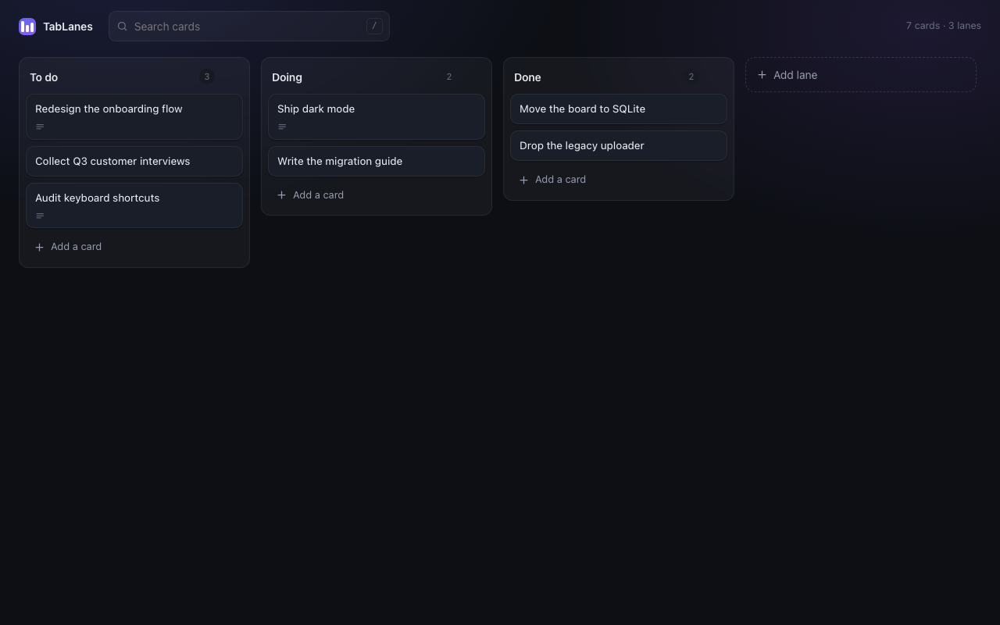

# TabLanes

A fast kanban board on every new tab. Lanes, cards, links, files and images —
stored locally in SQLite, never uploaded.



## Install

**From source**

1. `chrome://extensions` → enable **Developer mode**
2. **Load unpacked** → select this directory

**From a package**

```bash
./scripts/package.sh
```

Then load the extracted `dist/tablanes-<version>.zip`, or upload it to the
Chrome Web Store — see [docs/store-listing.md](docs/store-listing.md).

## How it works

There is no filesystem inside a Chrome extension, so TabLanes runs SQLite itself
— [sql.js](https://sql.js.org), SQLite compiled to WebAssembly, vendored under
`vendor/` — against a real schema with foreign keys and cascading deletes. The
database is serialized into IndexedDB on a short debounce, and flushed when the
tab is hidden so nothing is lost on a fast close.

Attachment blobs are kept in a separate IndexedDB store, keyed from the
`attachments` table, so saving the database stays cheap no matter how many
images you add. Orphaned blobs are reclaimed at startup.

Cards and lanes are ordered by a fractional `position`, so a drag is a single
`UPDATE` rather than a renumbering of the lane.

| File | Role |
| --- | --- |
| `src/db.js` | SQLite lifecycle, schema, persistence |
| `src/store.js` | Domain queries: lanes, cards, links, attachments, undo |
| `src/idb.js` | IndexedDB wrapper |
| `src/dnd.js` | Pointer-based drag and drop with FLIP animation |
| `src/modal.js` | The card editor dialog |
| `src/ui.js` | Element helper, icons, toasts, menus |
| `src/app.js` | Render loop and wiring |

## Privacy

No network requests, no accounts, no analytics, no remote code. See
[PRIVACY.md](PRIVACY.md).

## Development

The board is a plain page, so it runs without being installed:

```bash
node scripts/screenshots.mjs
```

serves the extension under the manifest's exact CSP and captures the store
screenshots into `store/screenshots/`.
